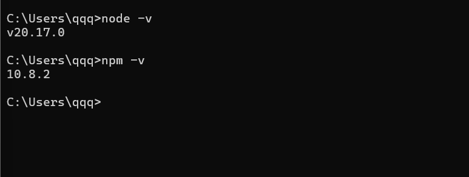
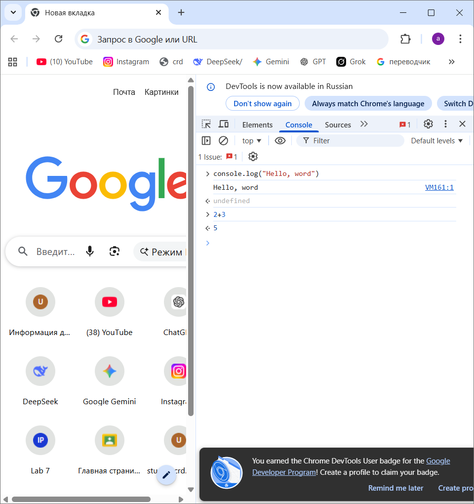
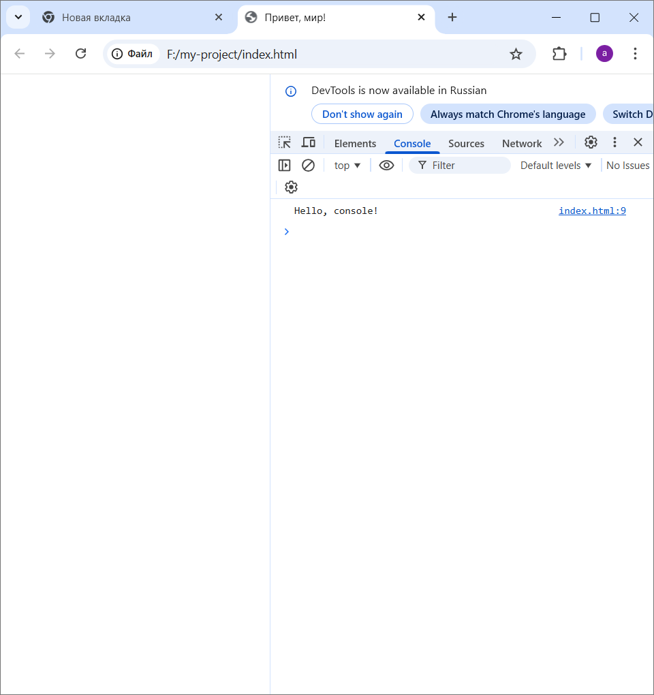
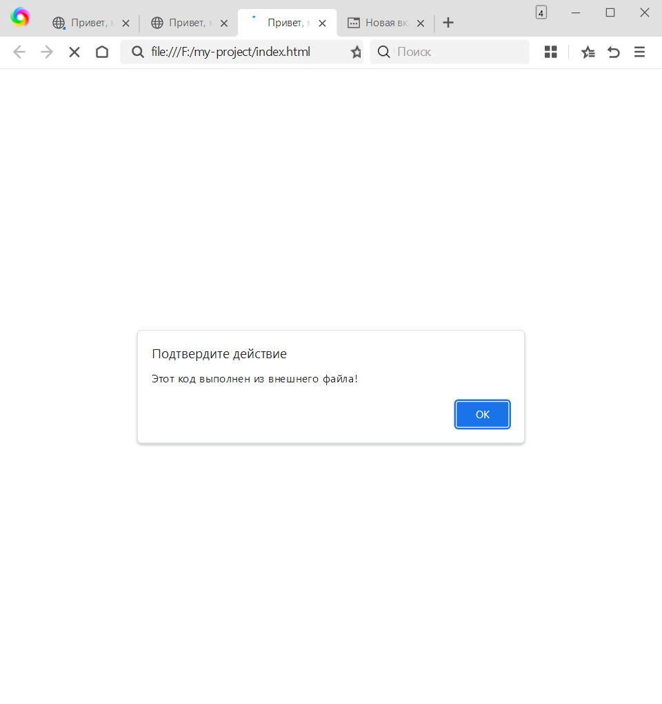
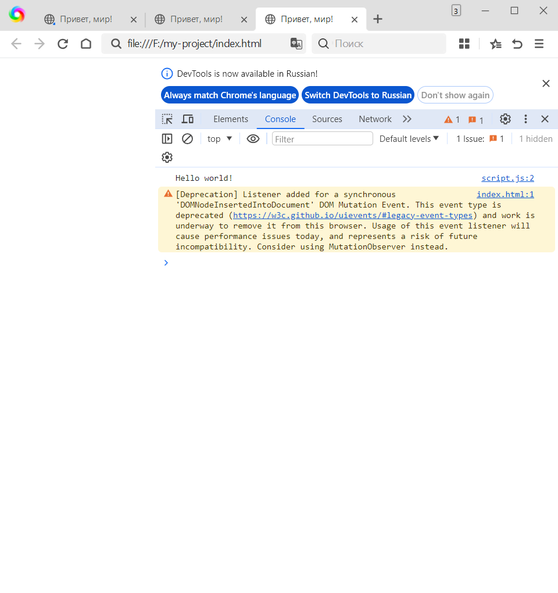
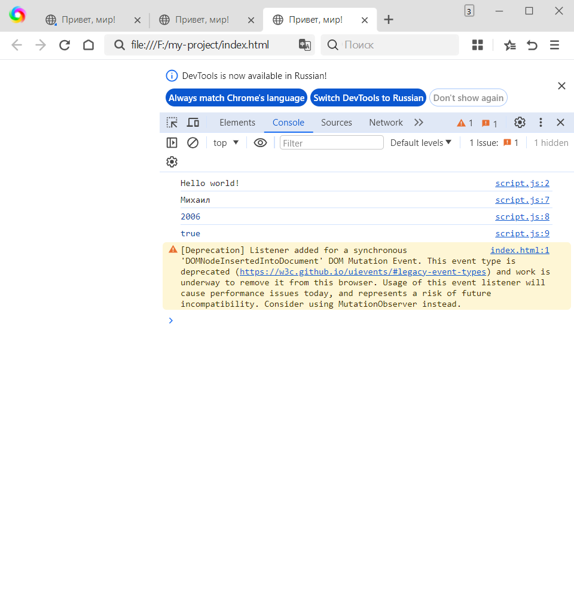
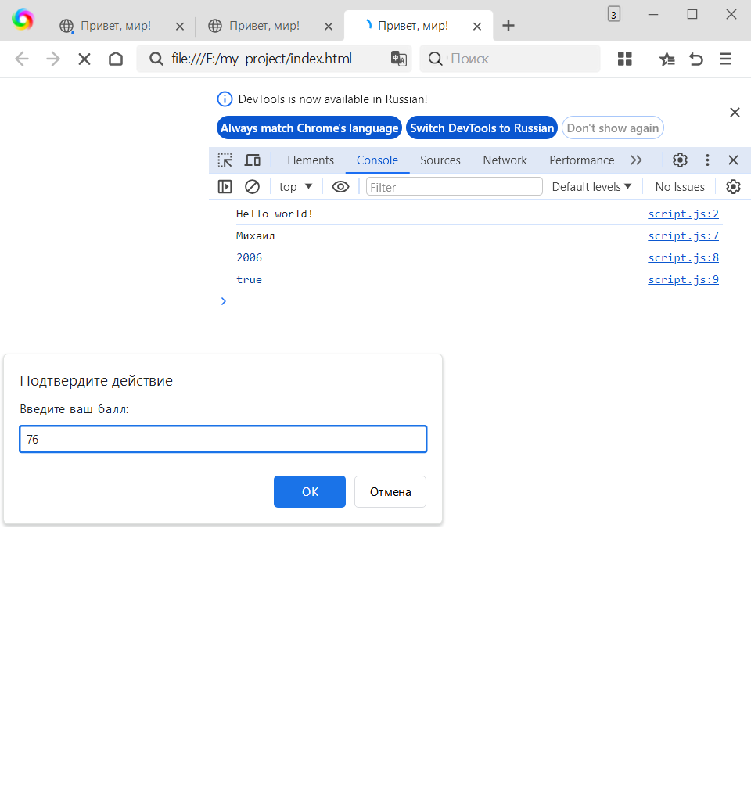
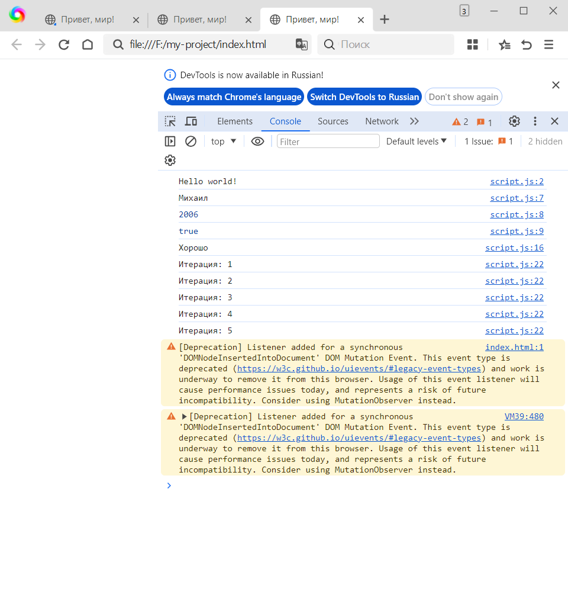

# Лабораторная работа №1  
## Выполнение JavaScript-кода в браузере и основы языка

---

### Цель работы
Изучить основы выполнения JavaScript-кода в браузере, научиться подключать скрипты к HTML-странице, работать с типами данных, условиями и циклами.

---

## Задание 1. Выполнение кода в браузере

### 1. Подготовка среды

Для выполнения лабораторной работы были выполнены следующие действия:

- Установлен текстовый редактор **Visual Studio Code**
- Установлена среда выполнения **Node.js**

- Открыта консоль разработчика в браузере с помощью клавиши **F12**

---

### 2. Выполнение JavaScript-кода в консоли браузера

В консоли разработчика был выполнен следующий код:

console.log("Hello, world!");

Также было выполнено арифметическое выражение:

2 + 3
В результате в консоли было выведено сообщение Hello, world! и получен результат вычисления 5.

3. Создание первой HTML-страницы с JavaScript
Был создан файл index.html со следующим содержимым:

<!DOCTYPE html>
<html lang="en">
  <head>
    <title>Привет, мир!</title>
  </head>
  <body>
    
  </body>
</html>

После открытия файла в браузере появилось диалоговое окно alert, а также сообщение в консоли разработчика.

4. Подключение внешнего JavaScript-файла
Был создан файл script.js со следующим кодом:

alert("Этот код выполнен из внешнего файла!");
console.log("Сообщение в консоли");
Файл был подключён в index.html следующим образом:

После открытия страницы код из внешнего файла успешно выполнился.

Задание 2. Работа с типами данных
1. Объявление переменных
В файле script.js были объявлены переменные различных типов данных:

let name = "Михаил";
let birthYear = 2006;
let isStudent = true;

console.log(name);
console.log(birthYear);
console.log(isStudent);
Значения переменных были успешно выведены в консоль браузера.

2. Условия и циклы
В script.js был добавлен следующий код:

let score = prompt("Введите ваш балл:");

if (score >= 90) {
  console.log("Отлично!");
} else if (score >= 70) {
  console.log("Хорошо");
} else {
  console.log("Можно лучше!");
}

for (let i = 1; i <= 5; i++) {
  console.log(`Итерация: ${i}`);
}
В результате работы программы:

Пользователь вводит балл

В консоль выводится соответствующее сообщение

Выполняется цикл от 1 до 5

1. Чем отличается var, let и const?

var — старый способ, сейчас почти не используют.

let — обычная переменная, значение можно менять.

const — переменная, значение менять нельзя.

2Что такое неявное преобразование типов?

Это когда JavaScript сам меняет тип данных автоматически.
3Разница между == и ===

== сравнивает только значения

=== сравнивает и значение, и тип
