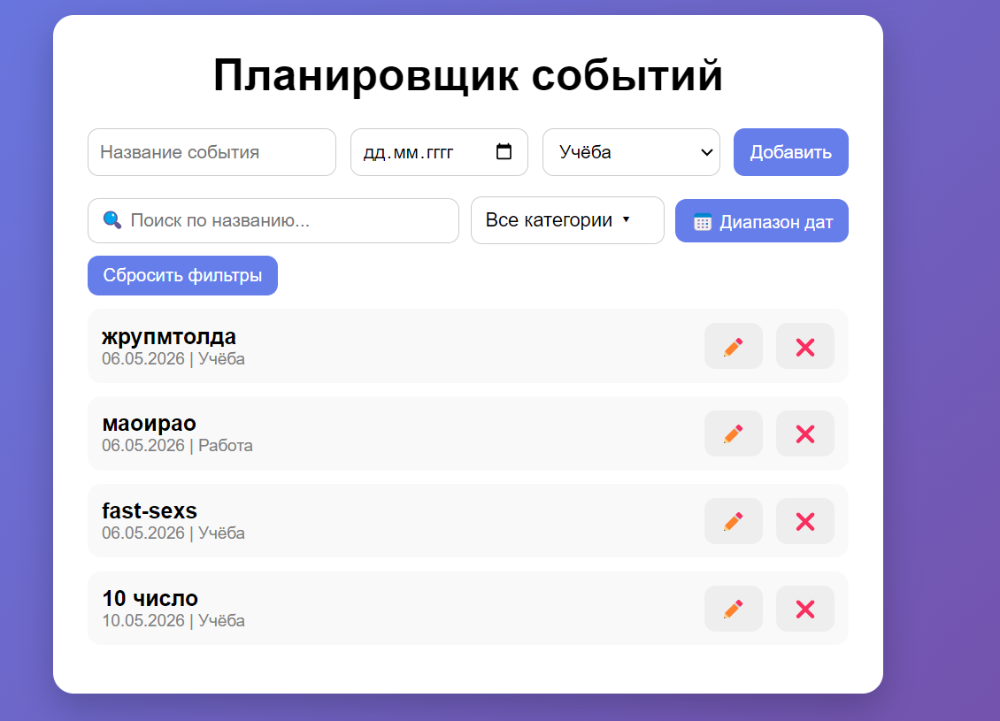

# 📅 Планировщик расписания

Веб-приложение для управления событиями и задачами с фильтрацией по дате и категории. Реализовано на чистом JavaScript (Vanilla JS) без использования сторонних фреймворков.

---

## 👤 Автор

- Чолак Андрей
- Группа:IA2503 
- Предмет:  JavaScript

---

## 📌 Описание проекта


**Цель:** Разработать интерактивный планировщик событий, демонстрирующий практические навыки работы с DOM, событиями, localStorage и модульной организацией кода.

**Основные функции:**
- Добавление событий с названием, датой и категорией
- Редактирование существующих событий
- Удаление событий
- Фильтрация по дате и категории
- Сохранение данных в `localStorage` (данные не теряются при перезагрузке страницы)

---

## 🗂️ Структура проекта

```
project/
├── index.html      # Разметка страницы
├── style.css       # Стили интерфейса
├── app.js          # Основная логика приложения
└── README.md       # Документация
```

---

##  Установка и запуск

Проект не требует установки зависимостей или сборки.

1. Скачайте или клонируйте репозиторий:
   ```bash
   git clone https://github.com/faa1257/Labs-JS
   ```
2. Откройте файл `index.html` в любом современном браузере (Chrome, Firefox, Edge).

> Никаких дополнительных зависимостей не требуется — всё работает «из коробки».

---

## 🛠️ Технологии

| Технология | Назначение |
|------------|------------|
| HTML5 | Структура страницы |
| CSS3 | Стилизация и адаптивность |
| JavaScript (ES6+) | Логика приложения |
| localStorage | Хранение данных в браузере |

---

## ⚙️ Описание реализации

### Работа с DOM
Элементы списка событий генерируются динамически через `document.createElement` и `innerHTML`. При каждом изменении данных список перерисовывается функцией `render()`.

### Обработка событий
- `submit` на форме — добавление или сохранение события
- `input` / `change` на фильтрах — мгновенная перефильтрация списка
- `onclick` на кнопках каждого события — редактирование и удаление

### Хранение данных
События хранятся в `localStorage` в виде массива объектов JSON. При загрузке страницы данные восстанавливаются автоматически.

### Фильтрация
Реализована двойная фильтрация: по конкретной дате и по категории (`all`, `work`, `personal`, `other` и т.д.). Фильтры работают одновременно.

### Редактирование
При нажатии кнопки ✏️ данные события подставляются в форму, а `editId` запоминает идентификатор редактируемого события. При отправке формы вместо создания нового — обновляется существующее.

### Разбор ключевых решений с кодом
 ## Хранение данных в localStorage
localStorage хранит только строки, поэтому массив объектов нужно сериализовать через JSON.stringify при записи и восстанавливать через JSON.parse при чтении. Обёртка в try/catch защищает от сбоя при повреждённых данных.
```
 Загрузка при старте приложения
let events = [];

const loadFromLocalStorage = () => {
  try {
    const raw = localStorage.getItem('schedule_events');
    // Если ключ не найден — getItem вернёт null, поэтому проверяем
    events = raw ? JSON.parse(raw) : [];
  } catch (e) {
    // JSON.parse может выбросить SyntaxError при повреждённых данных
    // В этом случае начинаем с чистого массива
    events = [];
  }
};

// Сохранение после каждого изменения
const saveToLocalStorage = () => {
  localStorage.setItem('schedule_events', JSON.stringify(events));
};

// Вызываем при загрузке страницы
loadFromLocalStorage();
```
---

## 💡 Примеры использования

**Добавление события:**
```
Название: Встреча с командой
Дата: 2025-06-10
Категория: Работа
→ Нажать "Добавить"
```

**Фильтрация:**
```
Выбрать дату: 2025-06-10
→ В списке отобразятся только события этой даты
```

**Редактирование:**
```
Нажать ✏️ рядом с событием
→ Поля формы заполнятся данными события
→ Изменить нужные поля → Нажать "Сохранить"
```

**Удаление:**
```
Нажать ❌ рядом с событием → событие удаляется из списка и localStorage
```

---

## 📋 Соответствие требованиям

| Требование | Реализация |
|---|---|
| Работа с DOM | Динамическое создание `<li>` элементов в `render()` |
| Обработчики событий | `submit`, `input`, `change`, `onclick` |
| Валидация ввода | Поля формы обязательны (`required`), встроенная валидация HTML5 |
| Массив объектов | Массив `events[]` с объектами `{id, title, date, category}` |
| Фильтрация | По дате и категории |
| localStorage | Сохранение и восстановление данных |
| ES6+ синтаксис | Arrow functions, destructuring, template literals, `const`/`let` |
| Адаптивный интерфейс | CSS с медиазапросами |

---

## 📚 Источники

1. [MDN Web Docs — localStorage](https://developer.mozilla.org/ru/docs/Web/API/Window/localStorage)
2. [MDN Web Docs — EventTarget.addEventListener()](https://developer.mozilla.org/ru/docs/Web/API/EventTarget/addEventListener)
3. [MDN Web Docs — Document.createElement()](https://developer.mozilla.org/ru/docs/Web/API/Document/createElement)
4. [MDN Web Docs — Array.prototype.filter()](https://developer.mozilla.org/ru/docs/Web/JavaScript/Reference/Global_Objects/Array/filter)
5. [JavaScript.info — Введение в браузерные события](https://javascript.info/introduction-browser-events)